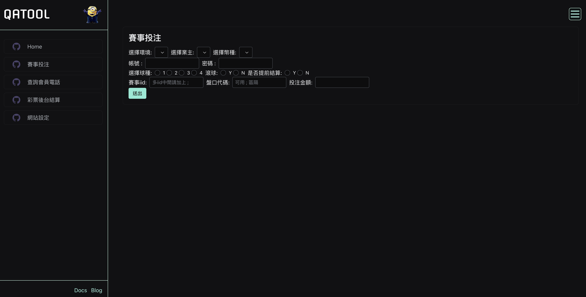

# Welcome to AT platform project!

This is the base Reflex template - installed when you run `reflex init`.

If you want to use a different template, pass the `--template` flag to `reflex init`.
For example, if you want a more basic starting point, you can run:

```bash
reflex init --template blank
```

## About this Template



This template has the following directory structure:

```bash
├── README.md
├── assets
├── rxconfig.py
└── AT_Platform
    ├── __init__.py
    ├── components
    │   ├── __init__.py
    │   └── sidebar.py
    ├── function
    │   ├── __init__.py
    │   ├── common.py           
    │   ├── platform.py         # request to platform backend api
    │   └── sport.py            # request to sport backend api
    ├── pages
    │   ├── __init__.py
    │   ├── decrypt_phone.py
    │   ├── index.py
    │   ├── settings.py
    │   └── sport_bet.py
    ├── styles.py
    ├── templates
    │   ├── __init__.py
    │   └── template.py
    └── AT_Platform.py
```

See the [Project Structure docs](https://reflex.dev/docs/getting-started/project-structure/) for more information on general Reflex project structure.

### Adding Pages

In this template, the pages in your app are defined in `{your_app}/pages/`.
Each page is a function that returns a Reflex component.
For example, to edit this page you can modify `{your_app}/pages/index.py`.
See the [pages docs](https://reflex.dev/docs/pages/routes/) for more information on pages.

In this template, instead of using `rx.add_page` or the `@rx.page` decorator,
we use the `@template` decorator from `{your_app}/templates/template.py`.

To add a new page:

1. Add a new file in `{your_app}/pages/`. We recommend using one file per page, but you can also group pages in a single file.
2. Add a new function with the `@template` decorator, which takes the same arguments as `@rx.page`.
3. Import the page in your `{your_app}/pages/__init__.py` file and it will automatically be added to the app.


### Adding Components

In order to keep your code organized, we recommend putting components that are
used across multiple pages in the `{your_app}/components/` directory.

In this template, we have a sidebar component in `{your_app}/components/sidebar.py`.

### Adding State

As your app grows, we recommend using [substates](https://reflex.dev/docs/substates/overview/)
to organize your state.

You can either define substates in their own files, or if the state is
specific to a page, you can define it in the page file itself.
